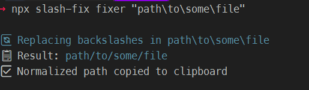

# Slash Fix

A CLI tool that automatically normalizes file paths by converting backslashes to forward slashes and copies the fixed path to your clipboard.

## ⬇️ Installation

This tool aims to be useful globally, not associated with a specific project. So I recommend installing it with `-g` flag

```bash
npm install -g slash-fix
```

## ⚙️ Usage

> [!IMPORTANT]
> The given path MUST be inside quotes ONLY if you are using `bash`

```bash
npx slash-fix fixer "path\to\some\file"
```

## 📊 Example Output



## 🧩 Use Cases

There is only one use-case which I aim to handle with this tool.

Sometimes I need to `copy` a relative or full path and use it as input to some other tool or process. All path from the `file-explorer` in windows have the following structure `path\to\some\file\somewhere` so I just paste it and manually replace the `\` with `/`.

This tool takes care of that. That's it 👌

> [!IMPORTANT]
> If you have any other case where this toll would be useful, please let me know how I can improve it.

## 🤝 How to contribute?

See [CONTRIBUTING.md](https://github.com/David-Pena/slash-fix/blob/main/CONTRIBUTING.md) file.
